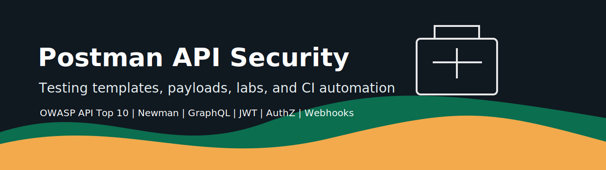
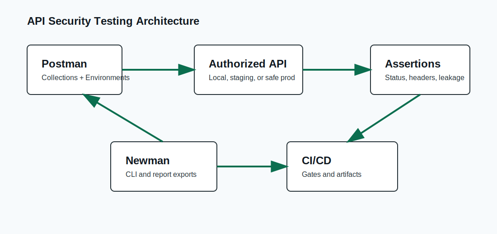

# Postman API Security Testing Templates



[](LICENSE)
[](collections)
[](scripts/newman)
[](docs/owasp-api-top10.md)

A production-grade open-source toolkit of reusable Postman collections, payloads, environments, lab APIs, and automation workflows for defensive API security testing.

> Use this project only on APIs you own, operate, or are explicitly authorized to test.

## What Is Included

- Importable Postman collections for authentication, authorization, JWT, GraphQL, SSRF, CORS, headers, file upload, rate limiting, IDOR, XSS, business logic, and OWASP API Top 10 coverage.
- Reusable payload files for safe validation of input handling and defensive controls.
- Local, staging, and production-safe Postman environments.
- Newman scripts for CLI, JSON, JUnit, and HTML-style reporting.
- GitHub Actions, Jenkins, Docker, and CI/CD examples.
- Intentionally vulnerable Flask and Node.js APIs for local practice.
- Mermaid diagrams, screenshot placeholders, and professional docs.

## Quick Start

```bash
git clone https://github.com/rksharma-owg/postman-api-security-testing-templates.git
cd postman-api-security-testing-templates
npm install
npm run test:local
```

Import any file under `collections/` into Postman, then import `environments/local.postman_environment.json`.

## Run With Newman

```bash
npm run test:auth
npm run test:owasp
npm run report:json
```

## Local Vulnerable Lab

```bash
docker compose -f vulnerable-api-lab/docker-compose.yml up --build
```

The lab exposes:

- Flask API on `http://localhost:8080`
- Node API on `http://localhost:8081`

## OWASP API Security Top 10 Mapping

| OWASP Category | Repository Coverage |
| --- | --- |
| API1 Broken Object Level Authorization | `collections/authorization`, `collections/idor` |
| API2 Broken Authentication | `collections/auth`, `collections/jwt` |
| API3 Broken Object Property Level Authorization | `collections/business-logic` |
| API4 Unrestricted Resource Consumption | `collections/rate-limit`, `collections/fuzzing` |
| API5 Broken Function Level Authorization | `collections/authorization` |
| API6 Unrestricted Access to Sensitive Business Flows | `collections/business-logic`, `collections/rate-limit` |
| API7 SSRF | `collections/ssrf` |
| API8 Security Misconfiguration | `collections/headers`, `collections/cors` |
| API9 Improper Inventory Management | `collections/api-versioning` |
| API10 Unsafe Consumption of APIs | `collections/webhook` |

## Visual Guide



See `docs/` for setup, automation, JWT testing, GraphQL testing, and remediation guidance.

## Repository Layout

```text
collections/             Postman collections grouped by security domain
payloads/                Reviewed canary payloads (9 categories, 11+ examples each)
environments/            Postman environment templates
scripts/                 Newman, CI/CD, Docker, and workflow examples
vulnerable-api-lab/      Local practice APIs
docs/                    Guides, mappings, diagrams, and screenshots
assets/                  Banner, diagrams, and visual placeholders
```

## Roadmap

- Add OpenAPI-driven collection generation.
- Add Postman visualizer dashboards.
- Add more cloud gateway policy examples.
- Add SARIF conversion for CI annotations.

## License

MIT. See `LICENSE`.
