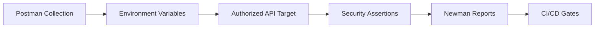
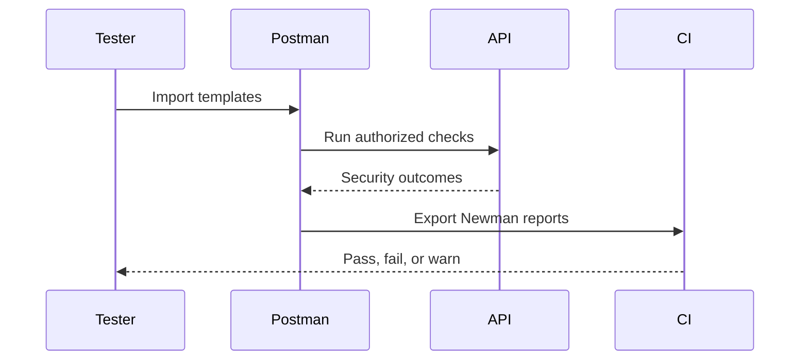

# Diagrams

## API Security Testing Flow

```mermaid
flowchart LR
  A[Postman Collection] --> B[Environment Variables]
  B --> C[Authorized API Target]
  C --> D[Security Assertions]
  D --> E[Newman Reports]
  E --> F[CI/CD Gates]
```

## Defensive Feedback Loop

```mermaid
sequenceDiagram
  participant Tester
  participant Postman
  participant API
  participant CI
  Tester->>Postman: Import templates
  Postman->>API: Run authorized checks
  API-->>Postman: Security outcomes
  Postman->>CI: Export Newman reports
  CI-->>Tester: Pass, fail, or warn
```
